# 新手也能轻松上手：100美金免费额度的VPS服务器购买与配置完整指南

---

对于想参与海外区块链项目测试、搭建节点或需要稳定海外网络环境的朋友来说，选择一台合适的VPS服务器是第一步。市面上的VPS服务商众多，配置复杂，价格不一，新手往往不知从何下手。更关键的是，很多项目对服务器的地理位置、网络速度和硬件配置都有明确要求。本文将手把手教你如何选购和配置一台性价比高、到国内速度快的VPS服务器，并附赠实用的Linux基础操作命令。

---

## 为什么选择Vultr

最近帮不少朋友配置服务器，对比了三家主流海外VPS服务商：

**Linode**：硬件配置是顶级的，堪称最强王者。唯一的遗憾是到国内的速度略差，延迟较高。

**DigitalOcean（DO）**：曾经是后起之秀，但这几年止步不前，市场份额已经大幅下降，实测表现不尽人意。

**Vultr**：直连中国大陆线路表现最强之一，到国内速度相当不错，而且支持支付宝付款，对国内用户非常友好。

综合性价比和实际使用体验，这次教程选择Vultr作为目标对象。更重要的是，Vultr近期有活动，新用户注册可获得100美金的测试额度（有效期14天），足够你完成大部分测试项目了。

**重要提示**：注册和登录时，请不要使用公共VPN或代理，否则容易被官方判定为重复账号，直接收回100美金的测试额度。

## 第一步：注册账户并激活测试额度

访问Vultr官网，输入你的邮箱地址和密码，点击"创建账户"按钮。

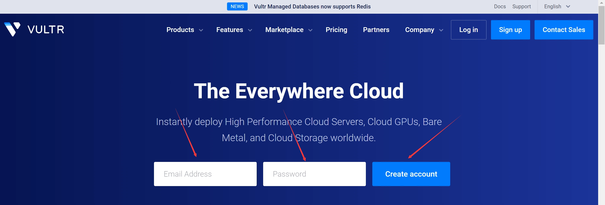

注册完成后，系统会自动跳转到充值和激活页面。可以看到Vultr支持信用卡、PayPal、加密货币和支付宝支付，对国内用户来说相当方便。

这里建议使用支付宝支付10美金（约70元人民币）完成首次充值，支付成功后即可立即获得赠送的100美金测试额度。再次提醒：请使用你自己的网络环境登录，不要使用公共代理，以免IP查重导致失去测试额度。

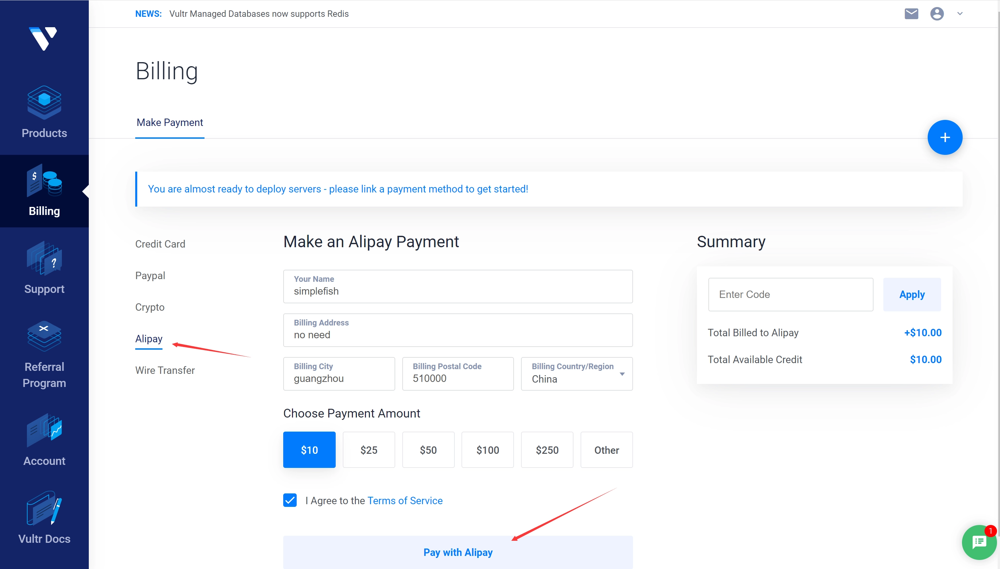

在弹出的支付宝页面完成支付后，你就可以开始购买和部署服务器了。

## 第二步：选择配置并部署服务器

点击进入产品页面（Products），开始选择你需要的服务器配置。

### 选择服务器类型

这里我选择价格最实惠的云计算方案（Cloud Compute，CPU共享型）。如果你的项目对计算性能或GPU有特殊需求，可以选择更高配置的方案，当然价格也会相应提高。

### 选择CPU类型

推荐选择AMD的CPU，性价比更高。

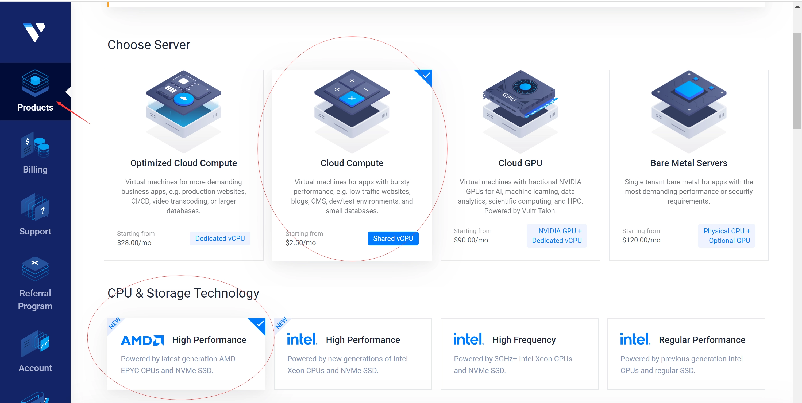

### 选择服务器地理位置

页面往下滑，需要选择服务器部署的地理位置。我这里选择的是新加坡节点，距离中国大陆较近，网络连接速度快，延迟低。👉 [想要更多数据中心选择和全球部署方案？这里有17个地理位置可选，覆盖亚洲、欧洲、美洲等主要地区](https://www.vultr.com/?ref=9738262-9J)

如果你参与的项目对IP所属国家或地理位置有明确要求（比如某些测试网要求特定地区节点），就根据项目要求选择对应的数据中心位置。

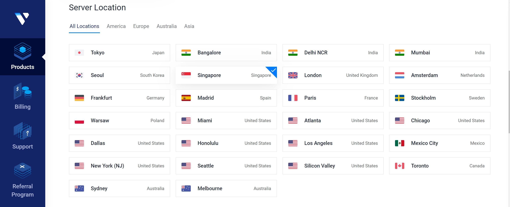

### 选择操作系统

继续往下，选择操作系统。这里我选择Ubuntu 20.04，稳定性好，社区支持完善，适合大多数应用场景。

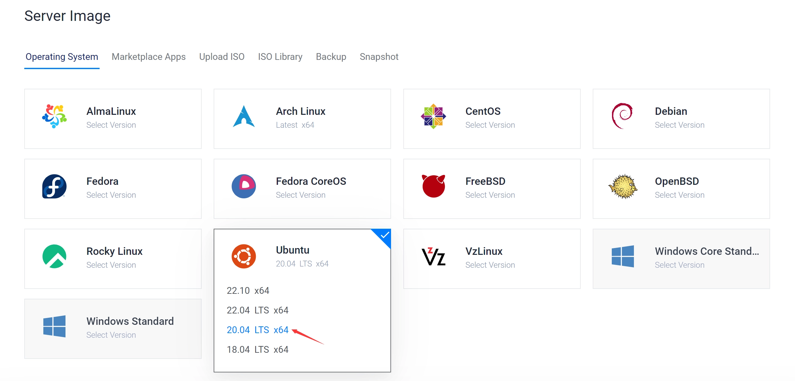

### 选择硬件配置方案

接下来是选择具体的硬件配置，这一步对费用影响最大。需要重点关注CPU核心数和内存大小，带宽一般都够用。

我这里选择的是12核24G配置。大家可以根据自己的实际需求进行选择。

**小提示**：如果你要参与Aleo节点测试，根据我的实测经验，8核CPU跑节点基本不出块，12核可以出块但数量较少，官方建议16核起步。想要提高出块效率的话，建议选择16核或更高配置。

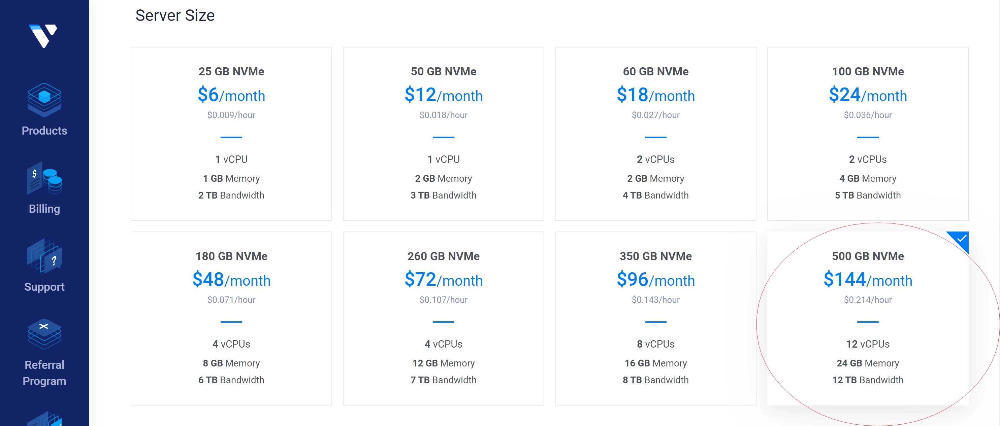

### 关闭自动备份功能

最后，记得将"Add Auto Backups"（自动备份）选项关闭。这个功能会额外收费，对于用完即删的测试项目来说不太必要，关掉可以省下一笔费用。

"Server hostname"可以随便填写，主要是在租用多台服务器时用来区分不同服务器名称的，方便管理。

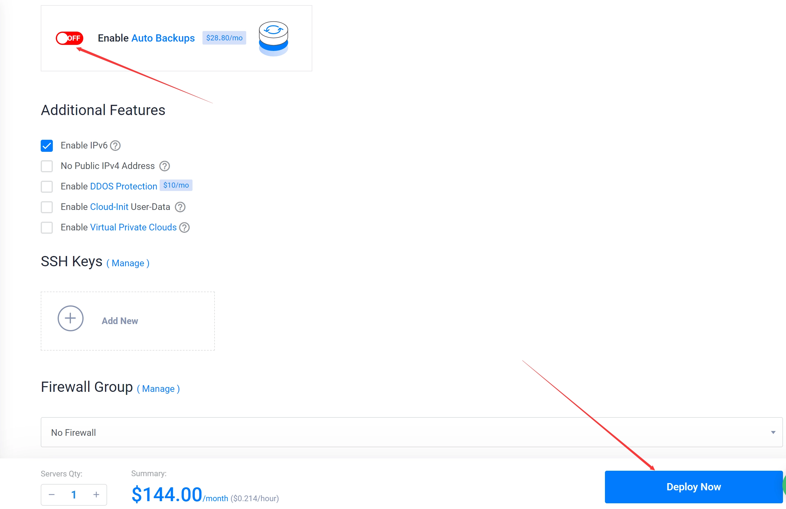

设置完成后，点击"Deploy Now"按钮，然后等待服务器自动安装配置。

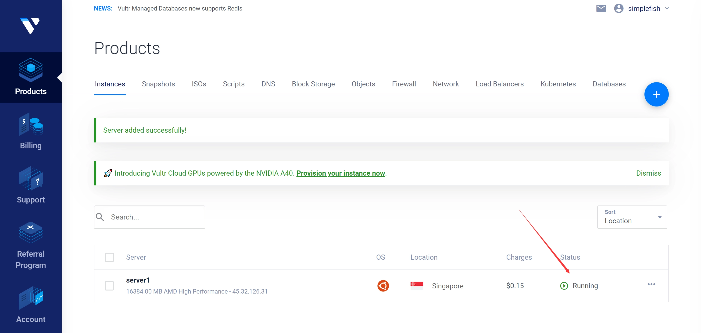

当你看到服务器状态（Status）显示为"Running"时，说明你的服务器已经成功部署并可以使用了。恭喜你完成了服务器购买的所有步骤！

## 第三步：登录服务器并进行基础设置

接下来我们要登录服务器进行操作。在服务器列表页面，点击你刚才创建的服务器名称。

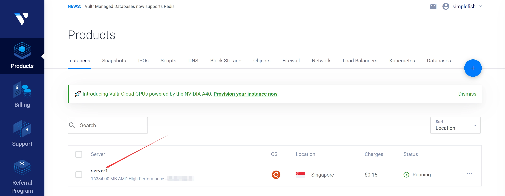

进入服务器详情页面后，点击右上角的小电脑图标，就可以通过网页版控制台连接服务器了。

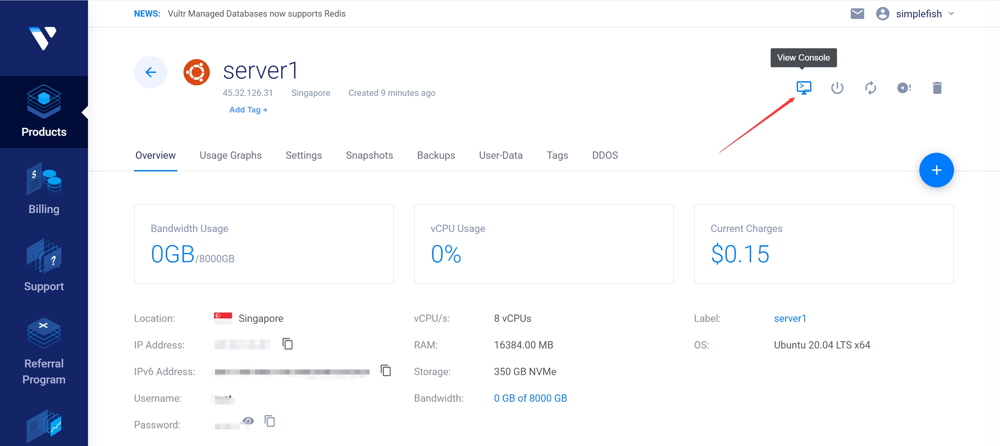

在弹出的Shell窗口中，首先输入账户名：`root`

密码位于服务器详情页面上，点击密码旁边的小眼睛图标即可查看。

复制密码后，在Shell窗口左侧打开辅助面板，选择第三个选项（剪贴板），然后把复制好的密码粘贴到剪贴板中，点击"Paste"按钮。注意，密码输入后界面上是看不到任何显示的，这是Linux系统的安全设计，不用担心。输入完成后按回车键，登录成功！

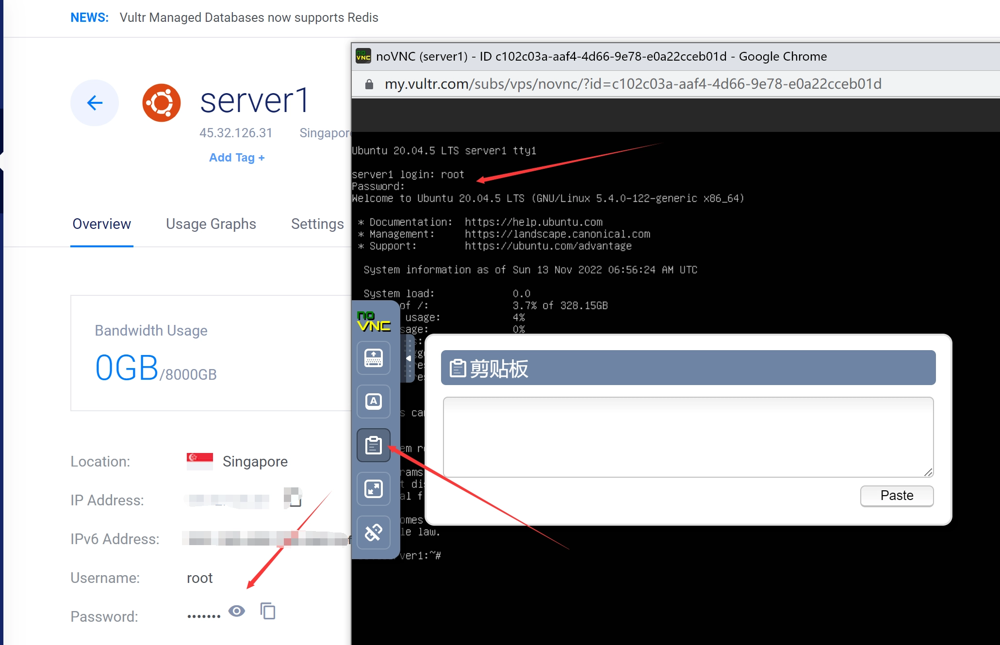

**使用提示**：Vultr自带的网页版Shell控制台不太方便，尤其是无法直接复制粘贴内容。如果需要复制服务器上的内容，可以截图后将图片发送到微信聊天窗口，长按图片选择"提取文字"功能。或者使用下面介绍的Xshell工具来操作，会方便很多。

## 第四步：使用Xshell连接服务器（可选但推荐）

如果你已经有自己习惯使用的SSH工具（比如SecureCRT、FinalShell等），可以跳过这一节。

访问Xshell官网下载安装程序。Xshell对个人用户完全免费，只需填写你的姓名和邮箱地址，下载链接会通过邮件发送给你。

在邮箱中收到下载链接后，下载并安装Xshell。安装完成后打开Xshell，在"所有会话"处点击鼠标右键，选择"新建会话"。

在新建会话属性面板中，填写以下信息：
- 会话名称：随便填，比如"Vultr新加坡"
- 主机IP地址：从Vultr服务器详情页面复制
- 端口号：保持默认的22即可

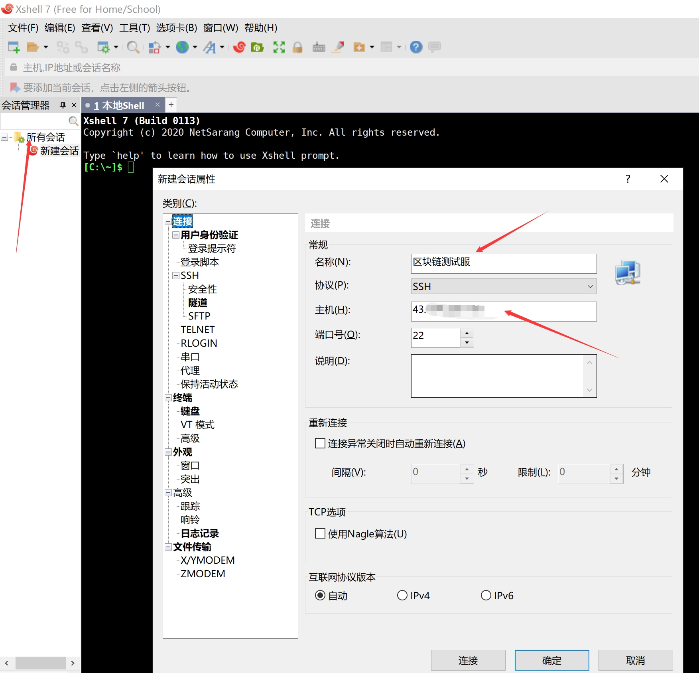

然后点击左侧的"用户身份验证"选项，输入服务器的登录用户名（root）和密码。密码位于Vultr服务器详情页面，参考前面"第三步"中的说明获取。

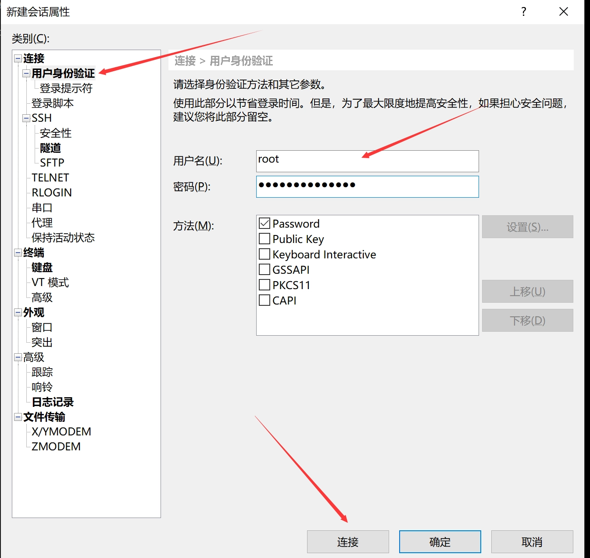

设置好账号密码后，点击"连接"按钮。第一次连接时会弹出SSH密钥确认提示，点击"接受并保存"就可以了。

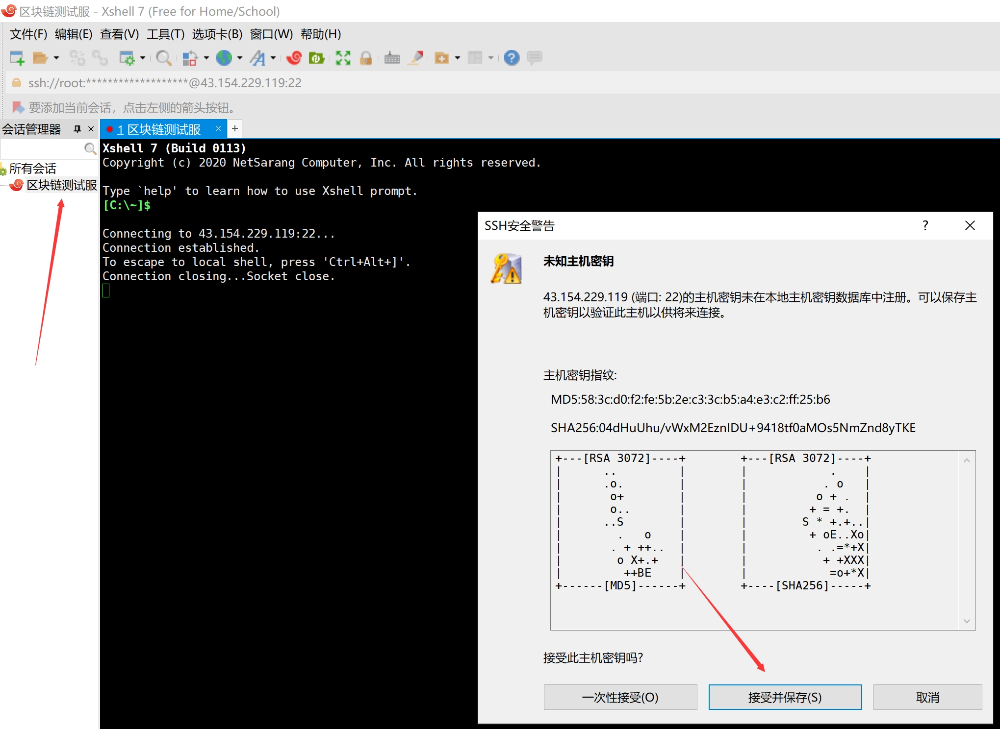

至此，你已经成功通过Xshell登录到服务器了。下次需要登录时，只需在左侧"所有会话"中双击对应的服务器名称即可快速连接。

**使用技巧**：在Xshell中进行复制和粘贴操作非常方便，只需要选中内容后点击鼠标右键，就可以进行复制、粘贴等操作。

## 第五步：常用Linux命令速查

终于成功登录到服务器了！下面列举几个最常用的Linux命令，方便你日常操作和管理服务器。如果你已经有Linux使用经验，可以直接跳过这一节。

**查看当前目录中的文件和文件夹**：
```bash
ls
```

**查看当前所在的目录路径**：
```bash
pwd
```

**查看磁盘使用情况**：
```bash
df -h
```

**查看服务器CPU、内存等资源使用情况**：
```bash
top
```
退出top命令界面：按 `Ctrl + C`

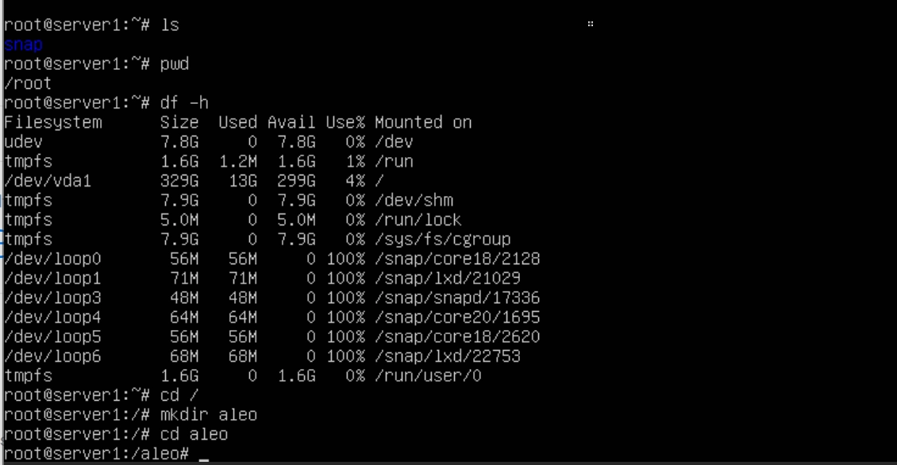

这些命令基本能满足日常的服务器监控和管理需求。随着使用经验的积累,你会逐渐掌握更多实用的Linux操作技巧。

---

## 总结

通过本文的详细步骤，你应该已经成功购买并配置好了自己的第一台VPS服务器。从注册账号获取100美金测试额度，到选择合适的硬件配置和地理位置，再到使用Xshell工具进行日常管理，整个流程其实并不复杂。

对于想参与区块链项目测试、搭建海外节点或需要稳定海外网络环境的用户来说，👉 [Vultr凭借其直连中国大陆的优质线路、灵活的配置选择和对国内用户友好的支付方式，确实是一个值得推荐的选择](https://www.vultr.com/?ref=9738262-9J)。特别是新用户100美金的测试额度，足够你完成大部分测试项目，真正做到零门槛上手。
